### Serverless Hello World

#### Open Lambda Console
When you click [here](https://console.aws.amazon.com/console/home)., the AWS Management Console will open in a new browser window, so you can keep this step-by-step guide open. In the top navigation bar, search for Lambda and open the AWS Lambda Console. 
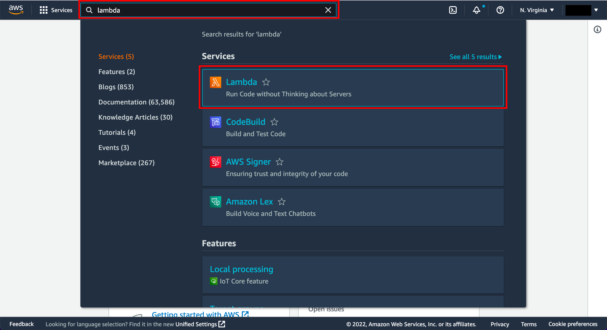

#### Select a Lambda Blueprint
Blueprints provide example code to do some minimal processing. Most blueprints process events from specific event sources, such as Amazon S3, Amazon DynamoDB, or a custom application.
a.  In the AWS Lambda console, choose Create function.
Note: The console shows this page only if you do not have any Lambda functions created. If you have created functions already, you will see the Lambda > Functions page. On the list page, choose Create a function to go to the Create function page.
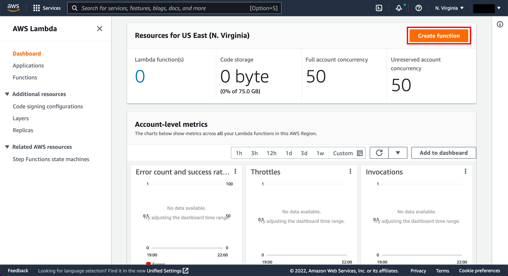
Select Create a Function
b.  Select use a blueprint.
c.  In the Filter box, enter hello-world-python and select the hello-world-python blueprint.
d.  Then choose Configure.
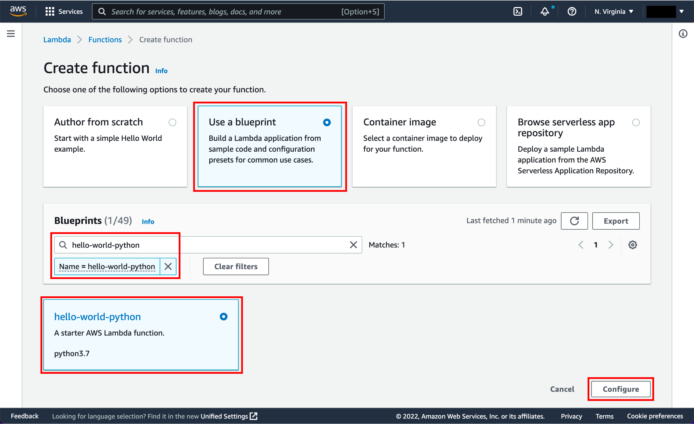
Create Function view

#### Configure and Create  Your Lambda Functions
A Lambda function consists of code you provide, associated dependencies, and configuration. The configuration information you provide includes the compute resources you want to allocate (for example, memory), execution timeout, and an IAM role that AWS Lambda can assume to execute your Lambda function on your behalf.
a. You will now enter Basic information about your Lambda function.

Basic information:

Name: You can name your Lambda function here. For this tutorial, enter hello-world-python.
Role: You will create an IAM role (referred to as the execution role) with the necessary permissions that AWS Lambda can assume to invoke your Lambda function on your behalf. Select Create a new role from AWS policy templates.
Role name: type lambda_basic_execution.
Lambda function code:
In this section, you can review the example code authored in Python.
b. Go to the bottom of the page and choose Create function.

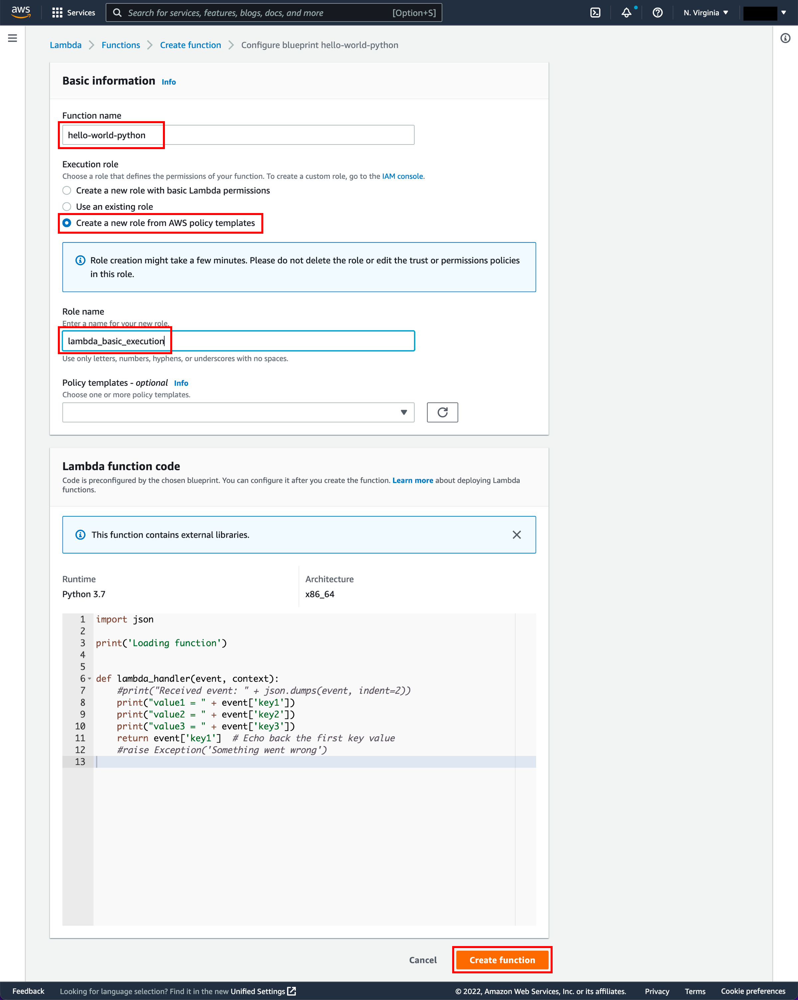

c. Runtime: Currently, you can author your Lambda function code in Java, Node.js, C#, Go, or Python. For this tutorial, use Python 3.7 as the runtime.

d. Handler: You can specify a handler (a method/function in your code) where AWS Lambda can begin executing your code. AWS Lambda provides event data as input to this handler, which processes the event.

In this example, Lambda identifies this from the code sample and this should be pre-populated with lambda_function.lambda_handler.

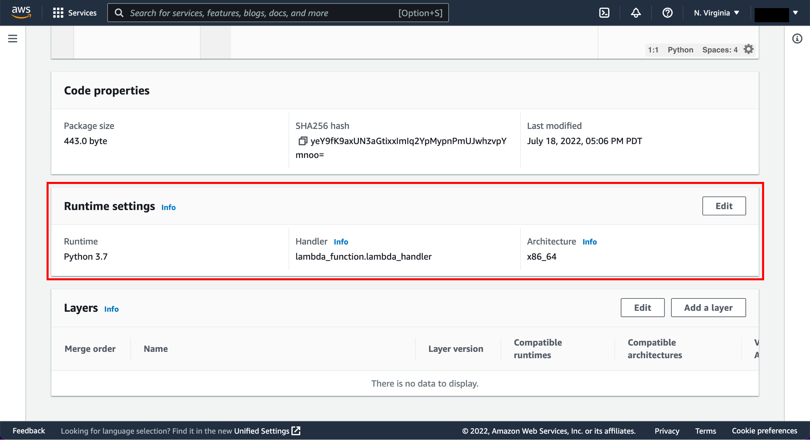

#### Invoke Lambda Functions and Verify Results

The console shows the hello-world-python Lambda function. You can now test the function, verify results, and review the logs.

a.  Select Configure Test Event from the drop-down menu called Test.
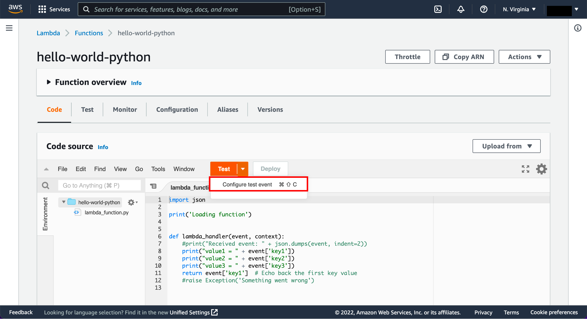

b.  The editor pops up so you can enter an event to test your function.  

Select Create new event.
Type in an event name like HelloWorldEvent.
Retain default setting of Private for Event sharing settings.
Choose hello-world from the template list.
You can change the values in the sample JSON, but don’t change the event structure. For this tutorial, replace value1 with hello, world!.
Select Create.

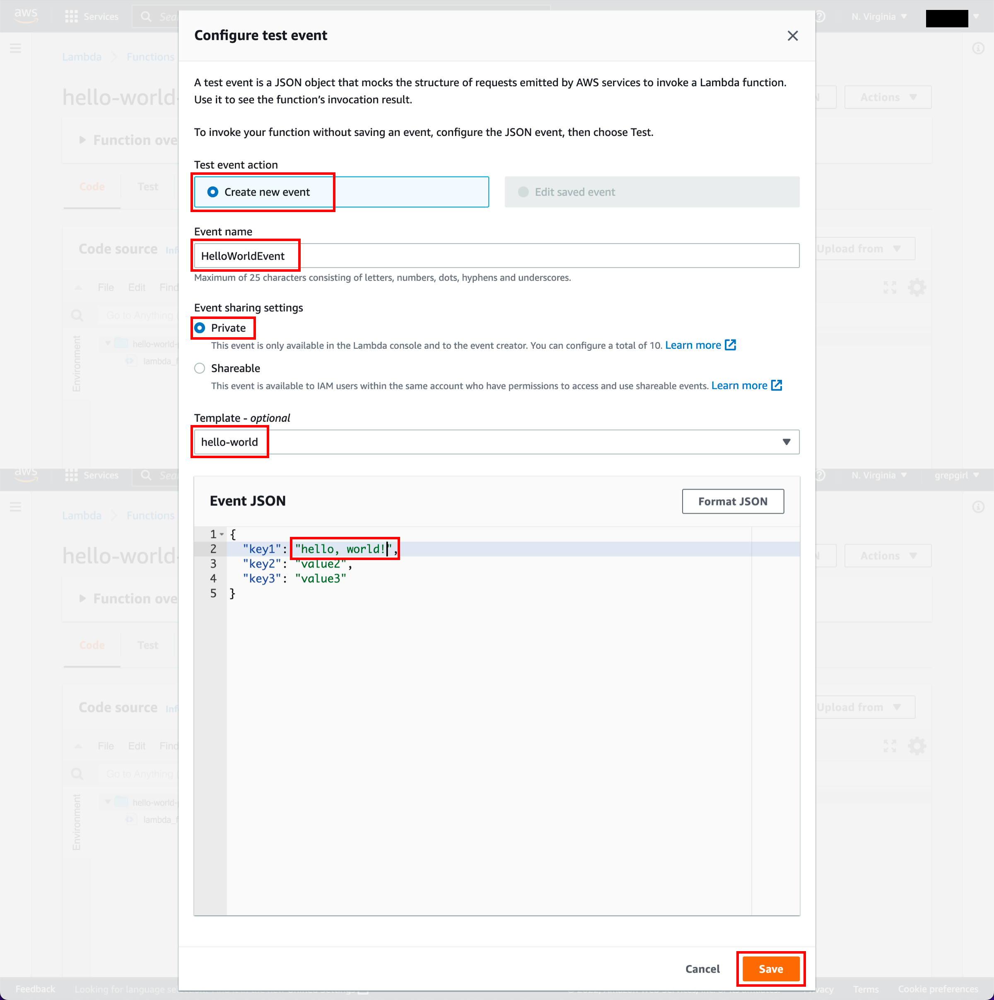

c. Choose Test.

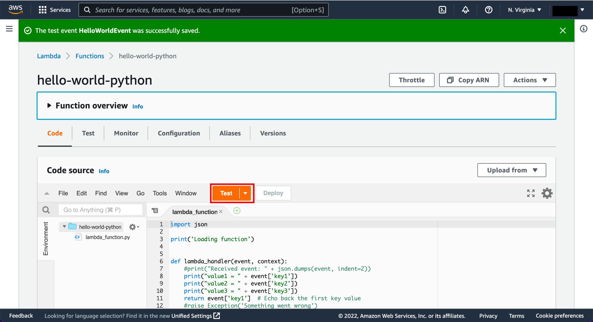

d. Upon successful execution, view the results in the console:
The Execution results tab verifies that the execution succeeded.
The Function Logs section will show the logs generated by the Lambda function execution as well as key information reported in the Log output.

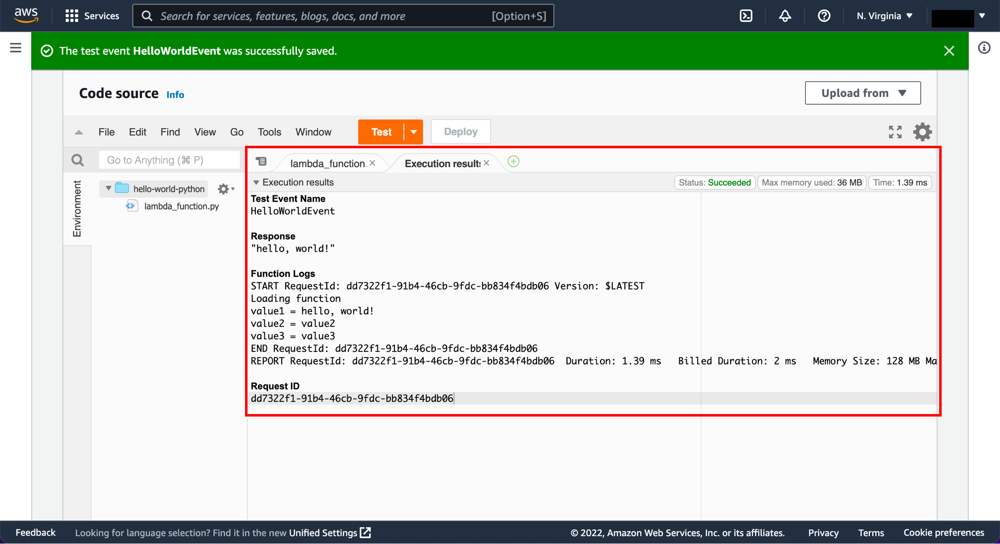

#### Monitor your metrics

AWS Lambda automatically monitors Lambda functions and reports metrics through Amazon CloudWatch. To help you monitor your code as it executes, Lambda automatically tracks the number of requests, the latency per request, and the number of requests resulting in an error and publishes the associated metrics. 

a. Invoke the Lambda function a few more times by repeatedly choosing the Test button. This will generate the metrics that can be viewed in the next step.

b. Select the Monitor tab to view the results.
c. Scroll down to view the metrics for your Lambda function.  Lambda metrics are reported through Amazon CloudWatch. You can leverage these metrics to set custom alarms. For more information about CloudWatch, see the Amazon CloudWatch Developer Guide.

The Monitoring tab will show seven CloudWatch metrics: Invocations, Duration, Error count and success rate (%), Throttles, Async delivery failures, IteratorAge, and Concurrent executions.

With AWS Lambda, you pay for what you use. After you hit your AWS Lambda free tier limit, you are charged based on the number of requests for your functions (invocation count) and the time your code executes (invocation duration). 

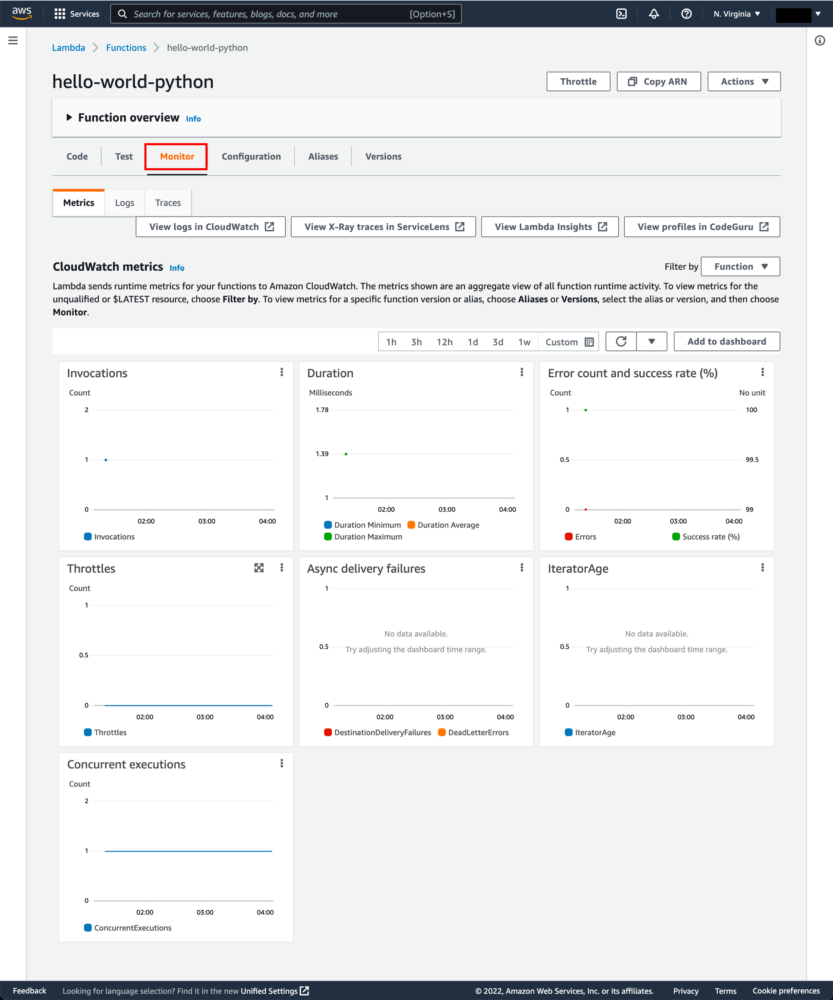

#### delete lambda function

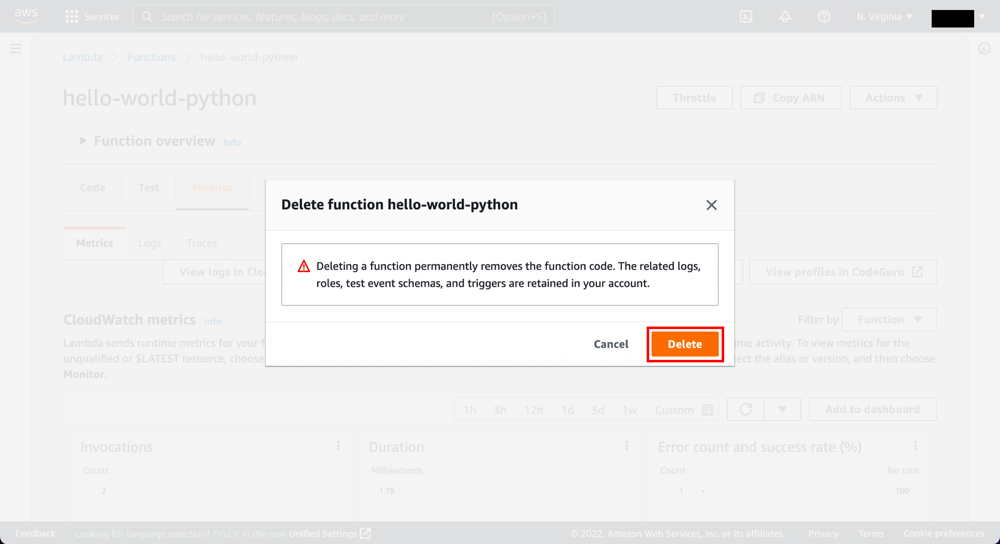