## Create a simple microservice using Lambda and API Gateway

### Create an API using Amazon API Gateway

Follow the steps in this section to create a new Lambda function and an API Gateway endpoint to trigger it:

To create an API

Sign in to the AWS Management Console and open the AWS Lambda console.

Choose Create Lambda function.

Choose Use a blueprint.

Enter microservice in the search bar. Choose the microservice-http-endpoint blueprint.

Configure your function with the following settings.

Name – lambda-microservice.
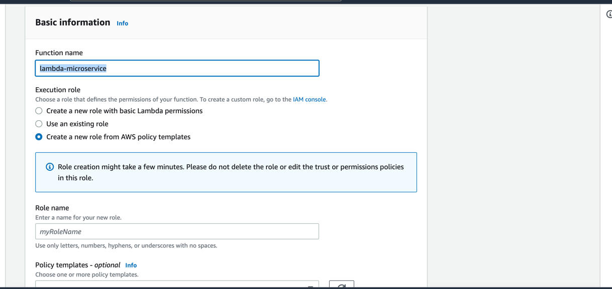

Role – Create a new role from AWS policy templates.

Role name – lambda-apigateway-role.

Policy templates – Simple microservice permissions.
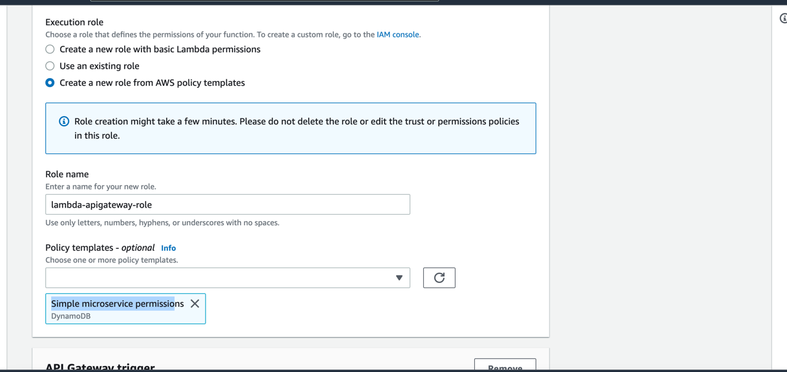


API – Create an API.

API Type – HTTP API.

Security – Open.

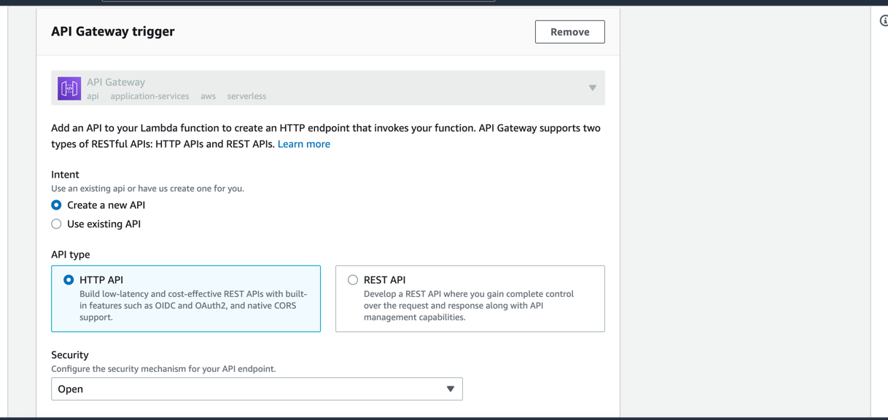


Choose Create function.

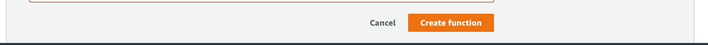

### Test sending an HTTP request
Choose Hello World Template
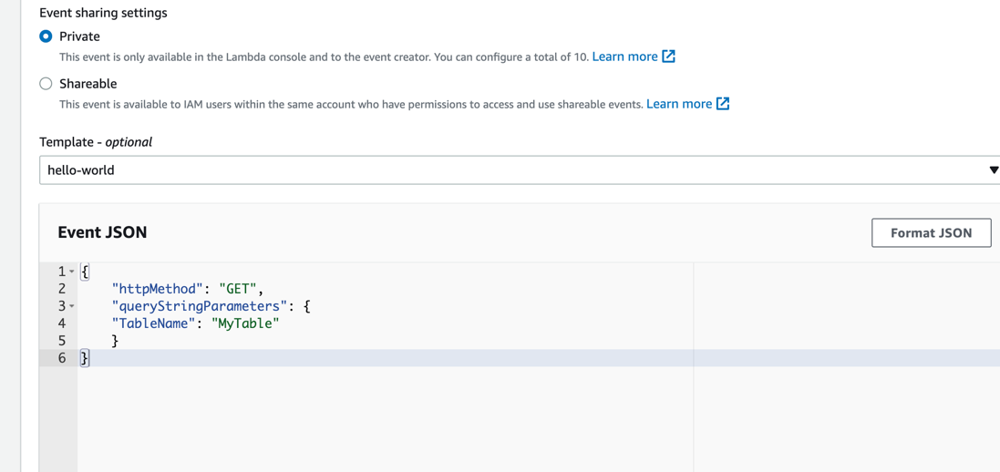

```
{
	"httpMethod": "GET",
	"queryStringParameters": {
	"TableName": "MyTable"
    }
}
```


### Create DynomoDB Table
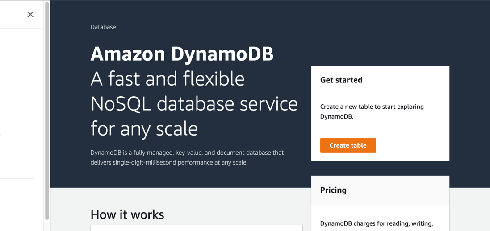

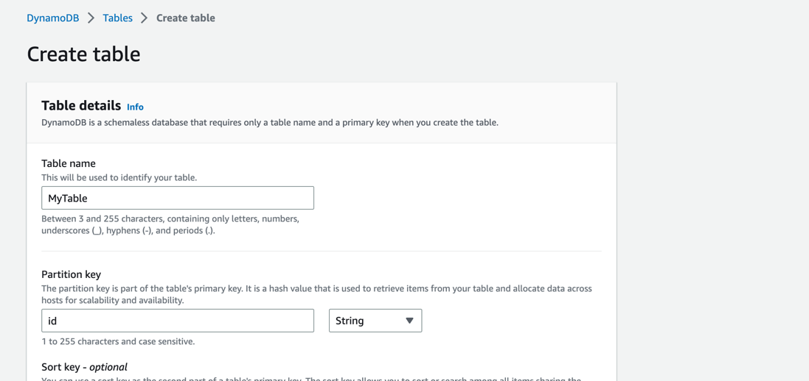

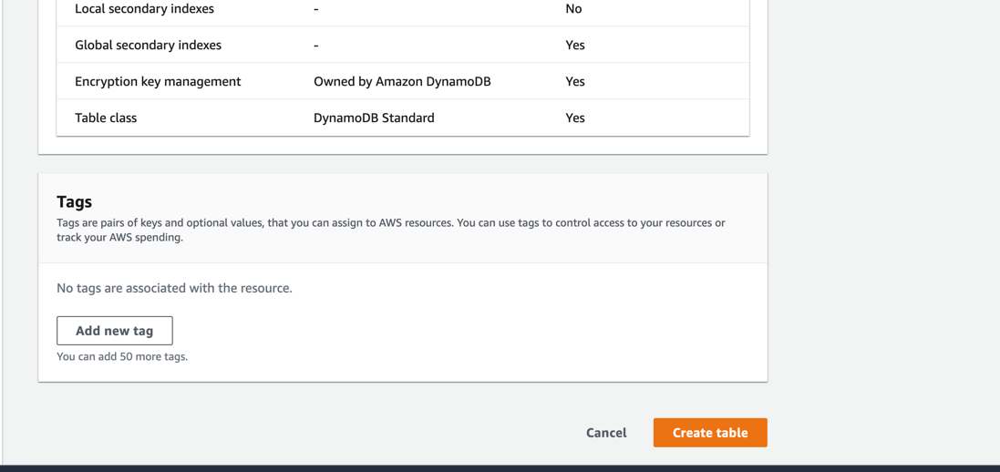

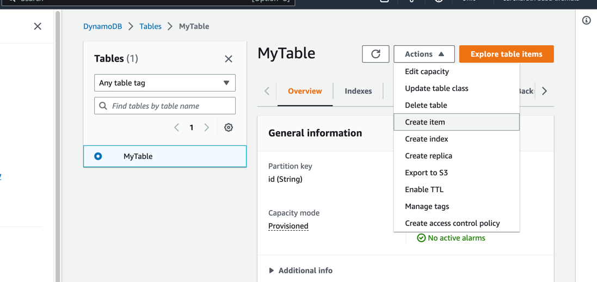


### Delete
Delete Role

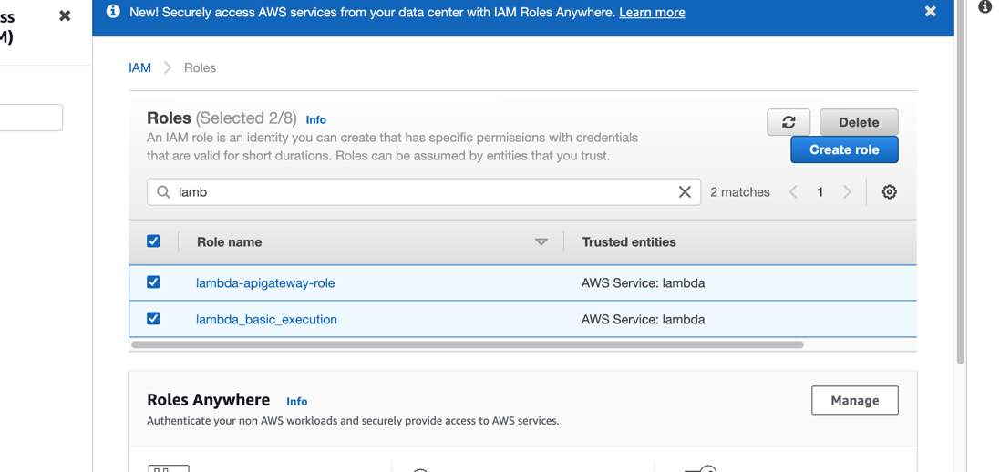

Delete Function
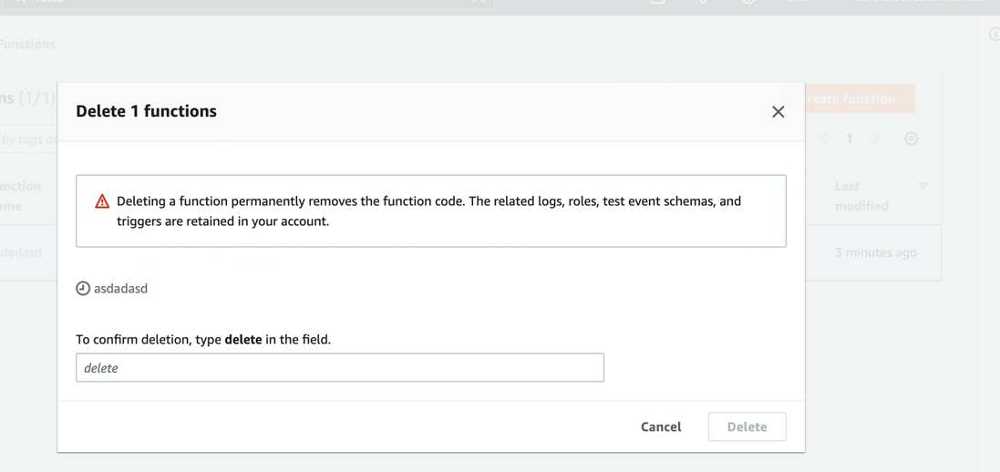

Delete Dynamo DB
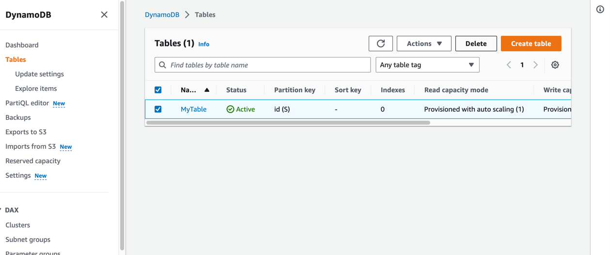
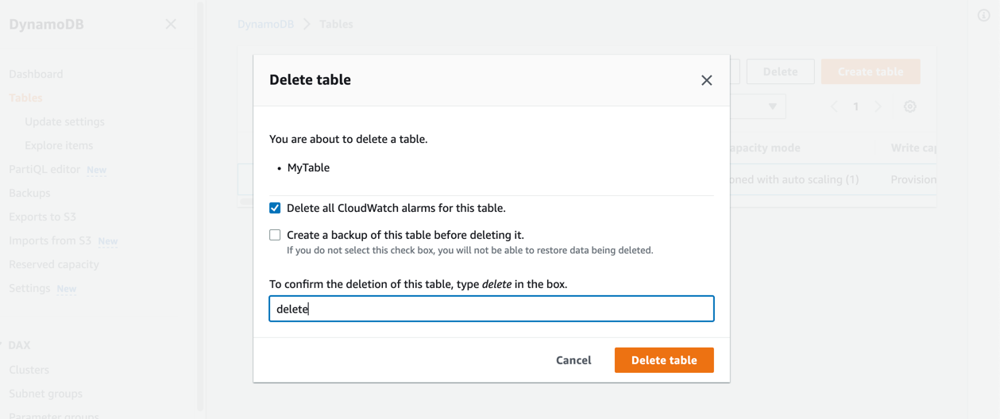